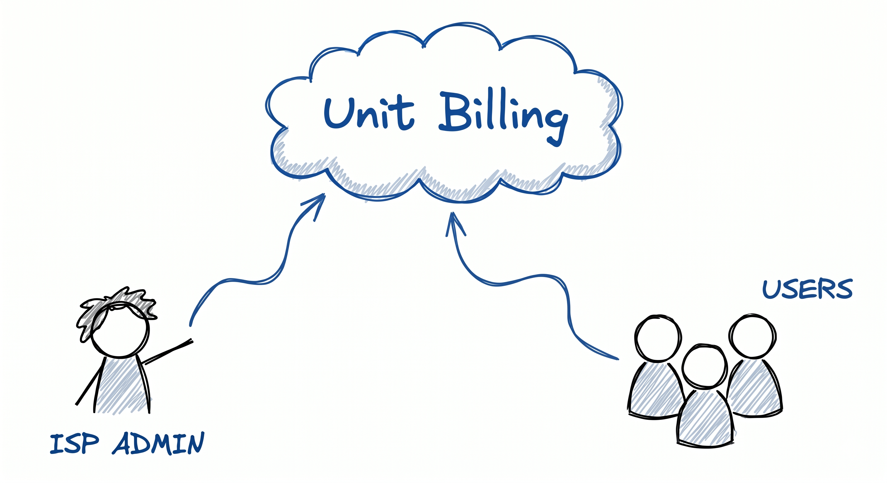
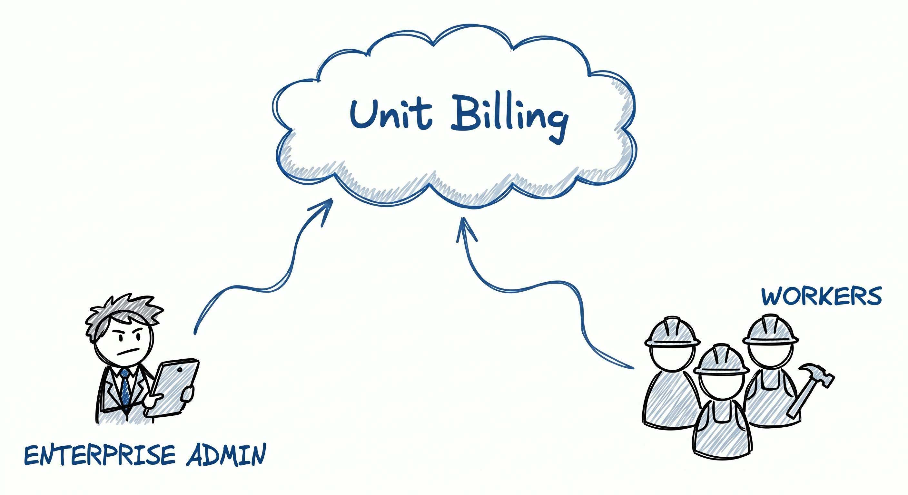
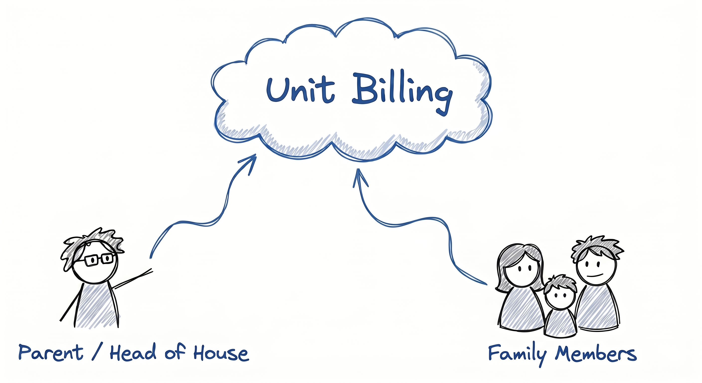

<div align="center">

<h1>🌐 Unit Billing Platform</h1>
<p><em>Reliable, scalable, and highly customizable billing solution for any business model</em></p>

  <p>
    <a href="https://github.com/m000gg/unit-billing/releases/latest"></a>
    <a href="https://github.com/m000gg/unit-billing/compare/main...develop"></a>
    <a href="https://github.com/m000gg/unit-billing/issues"></a>
    <a href="https://github.com/m000gg/unit-billing/network/members"></a>
  </p>

</div>

---

## Contents
* *[About this project](#about-this-project)*
* *[Use Cases](#use-cases)*
* *[Target Users](#target-users)*
* *[Problem Statement](#problem-statement)*
* *[Features](#features)*
* *[Project Structure](#project-structure)*
* *[Architecture Overview](#architecture-overview)*
* *[Technology Stack](#technology-stack)*
* *[Getting Started](#-getting-started)*
* *[Configuration](#configuration)*
* *[Authors](#-authors)*
* *[Questions](#questions)*
* *[License](#license)*

---

## About this project
This project is a flexible billing and customer management platform designed to adapt to any business model. 
The goal of the project is to simplify business operations, reduce administrative workload, and provide transparent financial and operational analytics for various use cases (such as SaaS, utility services, digital subscriptions, and ISPs). 
Additionally, it includes a dedicated client application that empowers users to easily manage their own accounts, subscriptions, and payments.

---

## Use Cases
Below are some example use cases for the billing application:

|                 Internet Service Provider                 |                               Enterprise                                |                      Local & Home Use                       |
|:---------------------------------------------------------:|:-----------------------------------------------------------------------:|:-----------------------------------------------------------:|
|  |  |  |

---


## Target Users
This open-source project is designed for any business that requires subscription management or invoicing, such as SaaS companies, digital service providers, utility networks, and ISPs.
The platform provides a centralized workspace for billing automation, service provisioning, and customer support operations.
For end-users (customers and subscribers), it offers a secure self-service portal to seamlessly track their active services, manage subscriptions, and handle payments.

---

## Problem Statement

Many small and medium businesses and service providers still rely on fragmented tools, manual accounting processes, spreadsheets, and isolated service management systems. This often leads to increased administrative workload, billing errors, poor service visibility, and difficulties in managing customers, payments, and service delivery efficiently.
Existing solutions may be too expensive, overly complex, or poorly adapted for smaller enterprises and growing businesses.
This project aims to provide a centralized billing and customer management platform that simplifies business operations, automates routine financial and operational tasks, and improves transparency across billing, customer management, and service administration processes, while simultaneously providing a clear, easy-to-use interface for the end-users themselves.

---
## Features
* Admin Authorization: Secure admin login and basic access control.

* User Registration: Streamlined sign-up process for new users.

* User Profiles: Personal dashboard for viewing basic account details.

* Client Self-Service: Subscribers can easily check their current balance, view invoices, and manage their personal information.

---

## Project Structure

```text
unit-billing/
├── pom.xml                        ← Root pom.xml
├── apps/                          ← Application of the project
│   │
│   ├── admin/                     ← Billing Application
│   │   ├── frontend/
│   │   └── backend/
│   │
│   └── client/                    ← Client Application
│       ├── frontend/
│       └── backend/
│
├── packages/                      ← Shared Parts of Code
│   ├── shared-core/
│   └── shared-ui-assets/
│  
├── database/                      ← Database
│   ├── migrations/
│   └── seed/
│
├── docker/                        ← Infrastructure Configs
│
├── scripts/                       ← Useful scripts
│  
├── docs/
│   ├── assets/                    ← Diagrams, images, and other media
│   │   └── readme/
│   │
│   ├── adr/                       ← Architecture Decision Records
│   ├── api/                       ← API Contracts (inbound)
│   ├── architecture/
│   │       ├── c4/                ← System structure (L1 ,L2, L3)
│   │       ├── domain/            ← Entities, business areas, rules
│   │       ├── integrations/      ← External services (outbound)
│   │       └── security/          ← Auth, roles, data protection
│   ├── features/
│   │   ├── admin-app/             ← Admin features descriptions
│   │   └── client-app/            ← Client features descriptions
│   └── manuals/                   ← Usage guides       
│
├── .env.example                   ← .env Example
├── .gitignore
├── docker-compose.yml
└── README.md               
```

---

## Architecture Overview
The project is currently designed as a modular monolith architecture.

---

## Technology Stack
| Category | Technologies |
|---|---|
| Backend | Java, Spring Boot |
| Database | PostgreSQL |
| ORM | Hibernate / Spring Data JPA |
| Security | Spring Security |
| Build Tool | Maven |
| Containerization | Docker, Docker Compose |
| Version Control | Git, GitHub |
| Frontend | HTML, CSS, JS |

---

## ⚡ Getting Started

### 1) Clone the repo

```
git clone https://github.com/m000gg/unit-billing.git
cd unit-billing
```


### 2) Requirements

Before starting the project, make sure the following tools are installed:

- Java 21+
- Maven 3.9+
- Docker
- Docker Compose
- PostgreSQL 16+

Docker is recommended for local development and database deployment.


### 3)  Installation

Build and start the application:

```bash
docker compose up --build
```

### 4) How to Use

Once the application is running, refer to the guides below:

- 📘 [Admin Application Guide](docs/manuals/admin-guide.md) — managing users, billing, and platform settings
- 📗 [Client Application Guide](docs/manuals/client-guide.md) — end-user portal navigation and account management

---

## Configuration

The application uses Spring Boot configuration files together with environment variables.


---

## 👥 Authors

* **m000gg** — *Core Development* — [GitHub](https://github.com/m000gg)
* **amatskevych** — *Project Lead / Mentoring* — [GitHub](https://github.com/amatskevych)


---

## Questions?

Open an Issue in this repo with a short description and steps to reproduce
For general questions or networking, see contact links in my overview [profile](https://github.com/m000gg "m000gg profile").

## License
This project uses a custom license model.
License details will be published together with the first stable release.
