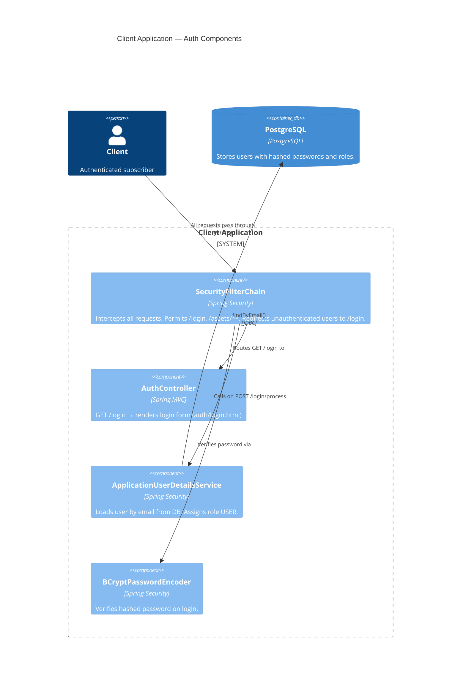

# Unit Billing Client App Authorization Component (Billing Platform)

---
## Changelog
| Version | Date       | Description            | Authors                             |
|---------|------------|------------------------|-------------------------------------|
| 1.0     | 2026-05-20 | Initial component view | [m000gg](https://github.com/m000gg) |

---
## Overview
This document provides a component-level overview of the Unit Billing Client Application's authorization component.

---
## Component Diagram
