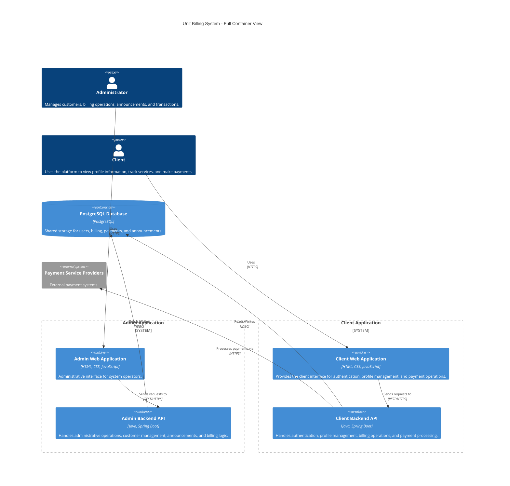

# Unit Billing Full Container View (ISP Billing Platform)

---
##  Changelog
| Version | Date       | Description            | Authors                                |
|---------|------------|------------------------|----------------------------------------|
| 1.0     | 2026-05-20 | Initial container view | [m000gg](https://github.com/m000gg)    |

---
## Overview
This document provides a detailed container-level overview of the Unit Billing System. The platform is divided into two main applications: Admin and Client, that are connected to a shared PostgreSQL database. The platform also integrates with external payment services used for secure payment processing.

---
## Architecture Style
The platform follows a modular web application architecture with separate client and administrative applications.

---
## Containers
- **Admin Web Application**: A web-based interface for administrators to manage customers/subscribers, billing operations, announcements, and transactions.
- **Admin Backend API**: A backend service that handles administrative operations, customer management, announcements, and billing logic.
- **Client Web Application**: A web-based interface for clients to authenticate, view profile information, check balances, view active services/subscriptions, and make payments.
- **Client Backend API**: A backend service that handles authentication, profile management, billing operations, and payment processing.
- **PostgreSQL Database**: A shared database that stores user information, billing data, payments, and announcements.

---
## Communication Flow
- The Admin Web Application communicates with the Admin Backend API over HTTPS using RESTful APIs.
- The Client Web Application communicates with the Client Backend API over HTTPS using RESTful APIs.
- Both the Admin Backend API and Client Backend API interact with the PostgreSQL Database using JDBC for data storage and retrieval.
- The Client Backend API communicates with external Payment Service Providers over HTTPS to process payments.

---

## External Systems
- **Payment Service Providers**: External systems that handle payment processing for the platform.

---
## Container Diagram

