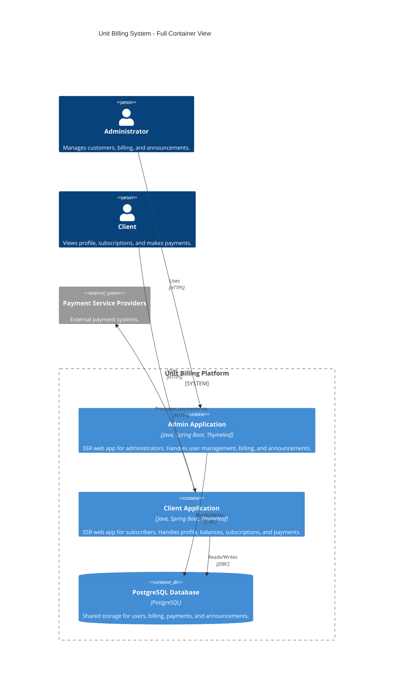

# Unit Billing Full Container View (Billing Platform)

---
## Changelog
| Version | Date       | Description                                   | Authors                             |
|---------|------------|-----------------------------------------------|-------------------------------------|
| 1.0     | 2026-05-20 | Initial container view                        | [m000gg](https://github.com/m000gg) |
| 1.1     | 2026-06-07 | Fix architecture: SSR replaces SPA + REST API | [m000gg](https://github.com/m000gg) |

---
## Overview
This document provides a container-level overview of the Unit Billing platform. The platform consists of two independent Spring Boot applications (Admin and Client) sharing a single PostgreSQL database. Both applications use server-side rendering via Thymeleaf — there is no separate frontend or REST API between browser and backend.

---
## Architecture Style
Modular SSR web application. Each application is a self-contained Spring Boot service rendering HTML via Thymeleaf.

---
## Containers
- **Admin Application**: A Spring Boot application with server-side rendering for administrators. Handles user management, billing operations, and announcements.
- **Client Application**: A Spring Boot application with server-side rendering for subscribers. Handles profile, balances, subscriptions, and payments.
- **PostgreSQL Database**: Shared database storing users, billing data, payments, and announcements.

---
## Communication Flow
- Browser communicates with each application directly over HTTPS — full HTML pages are returned (SSR).
- Both applications interact with PostgreSQL via JDBC.
- Client Application communicates with external Payment Service Providers over HTTPS.

---
## External Systems
- **Payment Service Providers**: External systems for payment processing.

---
## Container Diagram

