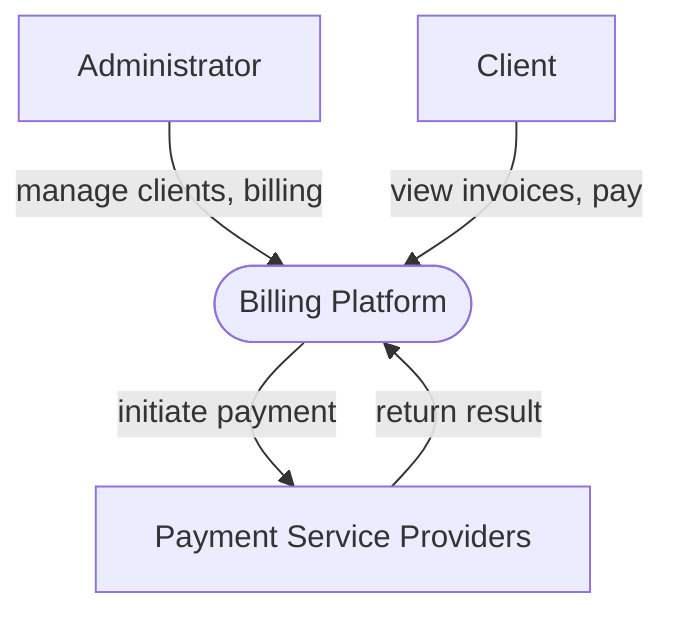

# Unit Billing System Context (Universal Billing Platform)

---
## Changelog
| Version | Date       | Description              | Authors                             |
|---------|------------|--------------------------|-------------------------------------|
| 1.0     | 2026-05-20 | Initial sys context view | [m000gg](https://github.com/m000gg) |

--- 

##  Purpose

The **Unit Billing System** is designed to manage billing processes for diverse business models, including SaaS, digital subscriptions, and utility services.

It enables:
- Administrators to manage users, subscriptions, and billing operations
- Clients to view active services, check invoices, and make payments

The system integrates with external payment service providers to process transactions securely and efficiently.

---

##  Problem It Solves

The system provides a centralized billing solution that:

- Manages customers, accounts, and subscriptions
- Tracks balances, payments, and billing cycles
- Reduces administrative overhead
- Improves the client self-service experience

---

##  Target Users

This system is created for:

- Businesses requiring subscription management or invoicing
- SaaS platforms and digital service providers
- Utility networks and Internet Service Providers (ISPs)
- Enterprise administrators

---

##  External Integrations

###  Payment Service Providers

The system integrates with external payment providers to:

- Process payments securely
- Support multiple payment methods
- Return transaction results to the billing platform

---

## ️ Core Responsibilities

###  Universal Billing Platform

- **User Management**
  - Create, update, delete customer accounts
  - Manage active services and subscriptions

- **Billing Management**
  - Track balances
  - Track payments
  - Manage custom billing cycles

- **Client Self-Service**
  - View invoices and service status
  - Make payments
  - Manage account information

---

##  System Architecture

