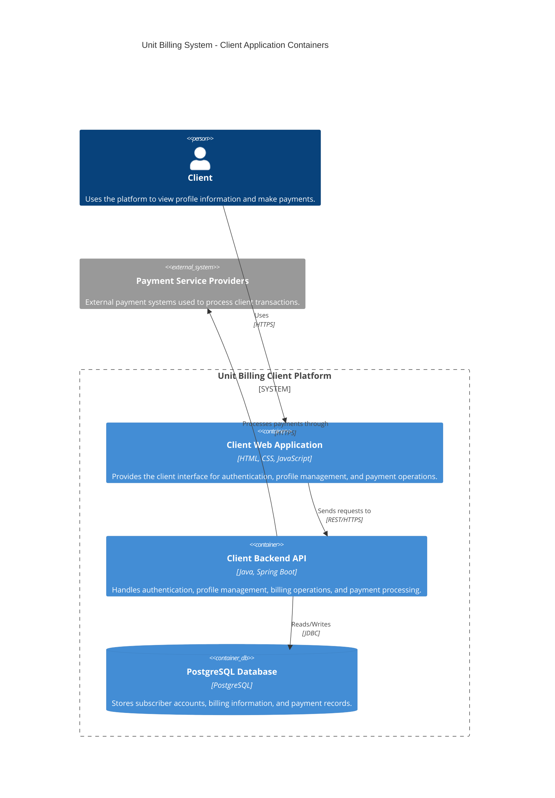

# Unit Billing Containers (ISP Billing Platform)

---

##  Admin Application

---

##  Client Application

```mermaid
C4Container
    title Unit Billing System - Client Application Containers

    Person(client, "Client", "Uses the platform to view profile information and make payments.")

    System_Boundary(client_system, "Unit Billing Client Platform") {

        Container(client_web, "Client Web Application", "HTML, CSS, JavaScript", "Provides the client interface for authentication, profile management, and payment operations.")

        Container(client_api, "Client Backend API", "Java, Spring Boot", "Handles authentication, profile management, billing operations, and payment processing.")

        ContainerDb(postgres, "PostgreSQL Database", "PostgreSQL", "Stores subscriber accounts, billing information, and payment records.")
    }

    System_Ext(payment_provider, "Payment Service Providers", "External payment systems used to process client transactions.")

    Rel(client, client_web, "Uses", "HTTPS")
    Rel(client_web, client_api, "Sends requests to", "REST/HTTPS")
    Rel(client_api, postgres, "Reads/Writes", "JDBC")
    Rel(client_api, payment_provider, "Processes payments through", "HTTPS")
```