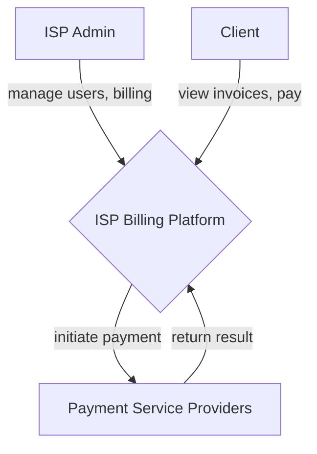

# Unit Billing System (ISP Billing Platform)

## 🎯 Purpose

The **Unit Billing System** is designed to manage billing processes for Internet Service Providers (ISPs).

It enables:
- ISP administrators to manage users and billing
- Clients to view invoices and make payments

The system integrates with external payment service providers to process transactions securely and efficiently.

---

## 🚨 Problem It Solves

The system provides a centralized billing solution that:

- Manages ISP users and subscriptions
- Tracks payments and billing cycles
- Reduces administrative overhead
- Improves client self-service experience

---

## 🏢 Target Users

This system is created for:

- Internet Service Providers (ISPs)
- Local network operators
- Telecom companies
- Enterprise network administrators

---

## 🔌 External Integrations

### 💳 Payment Service Providers

The system integrates with external payment providers to:

- Process payments securely
- Support multiple payment methods
- Return transaction results to the billing platform

---

## ⚙️ Core Responsibilities

### 👨‍💼 ISP Billing Platform

- **User Management**
    - Create, update, delete user accounts

- **Billing Management**
    - Create announcements
    - Track payments
    - Manage billing cycles

- **Client Self-Service**
    - View invoices
    - Make payments
    - Manage account information

---

## 🔄 System Architecture

