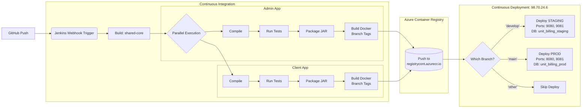

# CI/CD Overview

---
## Changelog
| Version | Date       | Description       | Authors                             |
|---------|------------|-------------------|-------------------------------------|
| 1.0     | 2026-06-17 | Initial CI/CD view| [m000gg](https://github.com/m000gg) |

---

## Summary

`unit-billing` uses a continuous integration and deployment pipeline built with Jenkins, Docker, and Azure infrastructure. The pipeline supports a monorepo structure, building shared libraries first, followed by parallel processing for the Admin and Client applications.

GitHub sends a webhook on every push. Pushes to any branch trigger the build and test stages. Pushes to the `main` branch additionally trigger an automated deployment to the production server.
 
---

## Infrastructure

| Component     | Technology                  | Description                                                                |
|---------------|-----------------------------|----------------------------------------------------------------------------|
| **CI Server** | Jenkins                     | Receives GitHub webhooks, compiles code, runs tests, builds Docker images. |
| **Registry**  | Azure Container Registry    | `registrycont.azurecr.io` — Stores built Docker images securely.           |
| **Prod Host** | Azure VM (Ubuntu)           |  Runs the application containers via Docker.                               |
 
---

## Pipeline Steps

Triggered by: **GitHub webhook on `push`**

1. **Build Shared:** Compiles the `shared-core` module without tests.
2. **Parallel Build:** Compiles code for `admin` and `client` apps simultaneously.
3. **Parallel Tests:** Runs Maven unit tests for both applications.
4. **Parallel Package:** Packages the final executable JAR files.
5. **Docker Build & Push:** Builds Docker images for both apps (tagged with build number and `latest`) and pushes them to Azure Container Registry.
6. **Deploy to Prod (*`main` branch only*):** Connects to the Production VM via SSH, pulls the latest images from ACR, and restarts the Docker containers on ports `8080` (Admin) and `8081` (Client).

---

## Architecture Diagram

