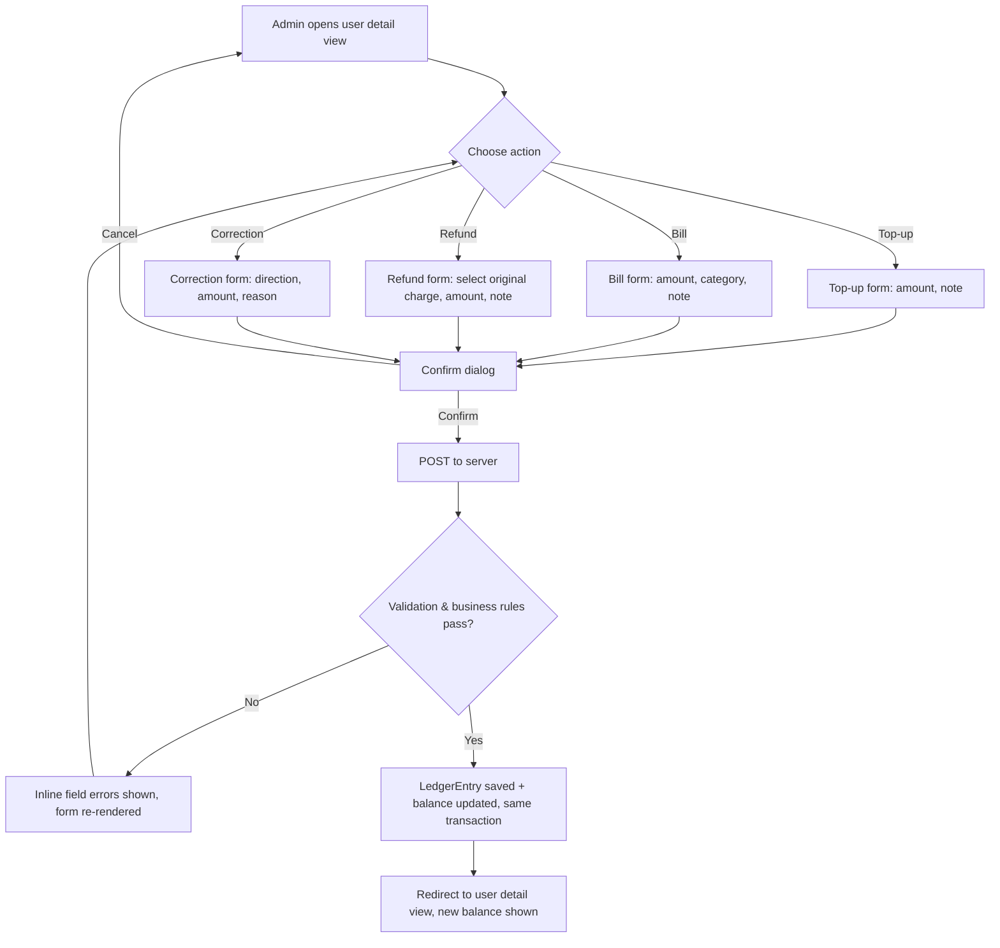
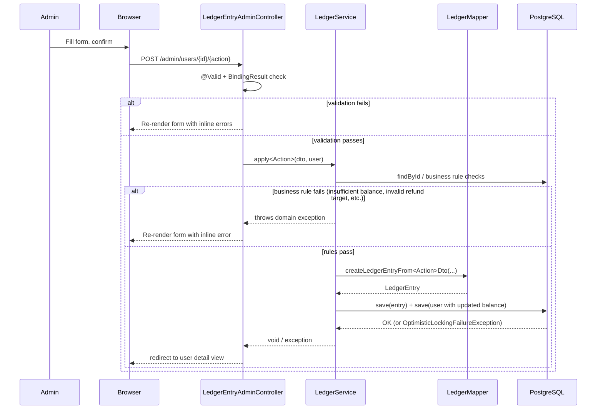

# Feature #4: Manual Ledger Entries (Top-up, Bill, Refund, Correction)

---
## Changelog
| Version    | Date       | Description                                                         | Authors                             |
|------------|------------|---------------------------------------------------------------------|-------------------------------------|
| 1.0        | 2026-08-08 | Initial feature: top-up, bill, refund, and correction admin actions | [m000gg](https://github.com/m000gg) |
---

- Issue #19 ➔ PR #25

## 👔Part 1: Product & Business

### Executive Summary
Admins currently have no way to adjust a subscriber's balance for anything
that happens outside the automated billing flow — a cash payment received in
person, a one-off service charge, a mistaken entry that needs reversing, or a
refund owed to a client. This feature gives admins four dedicated actions on
the user detail view — **top-up**, **bill**, **refund**, and **correction** —
each recorded as an auditable `LedgerEntry`, so every manual balance change
has a clear type, amount, and reason attached to it.

### Feature objectives
- Let an admin credit a subscriber's balance (top-up) in under 30 seconds
  from the user detail view, with the new balance visible immediately after.
- Let an admin debit a subscriber's balance for a rendered service (bill),
  categorized, with the same immediacy.
- Let an admin reverse a specific prior charge (refund), capped at the
  charge's original amount, preventing double-refunds.
- Let an admin correct a balance in either direction (correction) with a
  mandatory reason, for cases the other three actions don't cover.
- Reject invalid input (zero, negative, non-numeric amounts) with inline
  errors before any transaction is applied — zero silent failures.

### Feature scope
**In scope:**
- Top-up, bill, refund, and correction forms on the user detail view.
- Server-side validation, confirmation step, and immediate balance update.
- Each action recorded as a distinct, typed `LedgerEntry`.
- Refund linkage to its original charge; correction requiring a reason.

**Out of scope:**
- Automated payment gateway integrations (Stripe, PayPal, etc.).
- Scheduled or recurring top-ups.
- Automated/system-triggered billing.
- Balance visibility in the Client App (separate feature).
- Filtering, searching, or exporting the transaction history (separate feature).

### User flow



### Use cases
- Admin tops up a subscriber who paid cash in person; balance increases
  immediately, entry recorded as `PAYMENT`.
- Admin bills a subscriber for a hardware replacement; balance decreases,
  entry recorded as `CHARGE` with a deduction category.
- Admin attempts to bill more than the subscriber's current balance; rejected
  with an inline error, no entry created.
- Admin refunds a specific prior charge in full; balance increases, entry
  recorded as `REFUND` linked to the original `CHARGE`.
- Admin attempts to refund a charge a second time; rejected — a charge can
  only be refunded once.
- Admin attempts to refund more than the original charge's amount; rejected.
- Admin corrects a balance downward to fix a duplicate top-up entered
  earlier; balance decreases, entry recorded as `CORRECTION_DECREASE`, reason
  required.
- Admin attempts a correction-decrease that would take the balance negative;
  rejected with an inline error.
- Two admins act on the same subscriber's balance concurrently; the second to
  save is rejected due to a version conflict rather than silently losing the
  first admin's change.

### Functional Requirements
- Amount fields reject zero, negative, and non-numeric values with inline errors. \
- Each action requires an explicit confirmation step before the transaction is applied. \
- Top-up and refund are optional-note actions; bill requires a category; correction requires a reason. \
- Refund requires selecting a specific, not-yet-refunded prior charge belonging to the same subscriber. \
- Bill and correction-decrease are rejected if they would take the balance negative. \
- On success, the balance shown in the admin view updates immediately (via redirect to the user detail view). \
- Every action is recorded as a `LedgerEntry` with a distinct, correctly-signed `EntryType`.

### Non-Functional Requirements
- Balance and ledger-entry writes happen inside a single database transaction per action — never partially applied. \
- Concurrent balance updates on the same subscriber are protected against lost updates (optimistic locking). \
- Amount precision is fixed and consistent across all four actions (see ADR0005). \
- Validation errors never surface as a raw 500 — always an inline, field-level message.

## 🛠Part 2: Technical Realisation

### Architecture & Integrations
This feature is server-rendered (Thymeleaf), consistent with the rest of the
admin panel — there is no JSON API involved; forms POST directly to
`LedgerEntryAdminController`, which delegates to `LedgerService` for all
business logic (validation against current balance, entry creation, balance
mutation) inside a single `@Transactional` boundary per action. No new
external integrations.



### Data models
All four actions write to the existing `ledger_entries` table via the shared
`LedgerEntry` entity. See **ADR0009** for the full rationale; summary below.

| Column               | Type                 | Notes                                                         |
|----------------------|----------------------|----------------------------------------------------------------|
| `id`                 | UUID                 | Primary key                                                     |
| `subscriber_id`      | UUID                 | FK to the affected subscriber                                   |
| `amount`             | NUMERIC(19,4)        | Always positive; sign is derived from `type`                    |
| `type`               | VARCHAR(50)          | `PAYMENT`, `CHARGE`, `REFUND`, `CORRECTION_INCREASE`, `CORRECTION_DECREASE` |
| `description`        | TEXT                 | Optional for top-up/refund/bill; required for correction        |
| `original_entry_id`  | UUID (self-FK)       | Set only for `REFUND`; references the charge being reversed     |
| `created_at`         | TIMESTAMP WITH TZ    | Set at entry creation                                           |

`ApplicationUser.balance` is a running total (not summed from ledger entries
on read) and carries a `@Version` column for optimistic locking.

| Action     | EntryType(s)                          | Balance effect | Required fields                          |
|------------|----------------------------------------|:---------------:|--------------------------------------------|
| Top-up     | `PAYMENT`                               | `+`              | amount                                      |
| Bill       | `CHARGE`                                | `-`              | amount, category                            |
| Refund     | `REFUND`                                | `+`              | amount, originalEntryId (must be a not-yet-refunded `CHARGE` owned by the same subscriber) |
| Correction | `CORRECTION_INCREASE` / `_DECREASE`     | `+` or `-`       | amount, direction, reason                   |

### API
Not a JSON API — server-rendered form POSTs under `web/admin`, one per action:

```
GET  /admin/users/{id}/topup       — render top-up form
POST /admin/users/{id}/topup       — apply top-up

GET  /admin/users/{id}/bill        — render bill form
POST /admin/users/{id}/bill        — apply bill

GET  /admin/users/{id}/refund      — render refund form (with refundable charges)
POST /admin/users/{id}/refund      — apply refund

GET  /admin/users/{id}/correction  — render correction form
POST /admin/users/{id}/correction  — apply correction
```

Each POST redirects to `GET /admin/users/profile/{id}` on success. Validation
and business-rule failures re-render the originating form with inline errors
via Spring's `BindingResult`.

### Open questions
*No questions.*