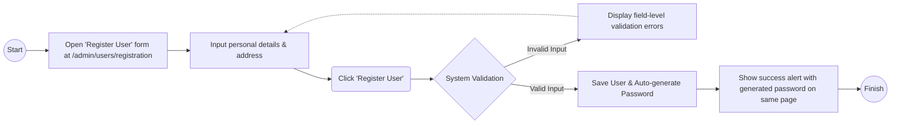
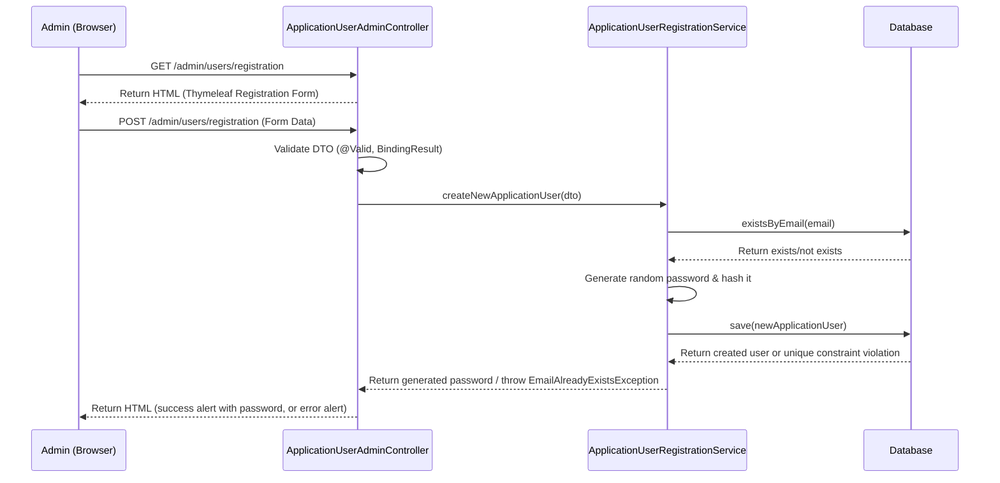

# Feature #1 *User Registration*: Admin can register new users
---
## Changelog
| Version   | Date       | Description                                                                                                           | Authors                             |
|-----------|------------|-----------------------------------------------------------------------------------------------------------------------|-------------------------------------|
| 1.0       | 2026-05-20 | Initial feature                                                                                                       | [m000gg](https://github.com/m000gg) |
| 1.1       | 2026-08-02 | Updated docs to match implementation: routes, form fields, sequence diagram (service layer), duplicate-email handling | [m000gg](https://github.com/m000gg) |
---

## 👔Part 1: Product & Business

### Executive Summary
This feature allows administrators to register new users into the billing platform, after a prospect submits an application. To register a new user, the administrator will need to provide necessary information such as full name, email,
& address. The system will validate the input data and create a new user account in the database. The password will be generated automatically and shown to the admin. This feature is essential for managing customers and ensuring that only authorized users can access the platform.

### Feature objectives
- Specific: Standardize and streamline the process for administrators to create new customer accounts (based on submitted applications) in the billing platform, including automatic secure password generation.
- Measurable: The feature will be considered successful if at least 90% of administrators can successfully register new users without errors.
- Attainable: Feasible as a standard Function built from scratch.
- Realistic: Speeds up onboarding & improves security.
- Time-bound: 3 Days for development and testing.

### Feature scope
In-scope includes creating the user database schema, building the admin form with validation (full name, email, address), and displaying an auto-generated password upon successful creation.
Out-of-scope explicitly excludes user login flows, automated email notifications, and account editing or deletion to ensure delivery within the 3-day timeframe.

### User flow

### Use cases
- **Successful Creation:** Admin inputs valid data (Full name, Email, Address) ➔ System creates user and displays the auto-generated password.
- **Validation Error:** Admin leaves required fields empty or enters an invalid email format ➔ System blocks submission and shows a validation error.
- **Duplicate User:** Admin enters an Email that already exists in the database ➔ System blocks creation and shows a "Duplicate" error.

### Functional Requirements
- The system must provide an admin form with fields: First name, Last name, Email, Phone number, Country, City, Region, Street, House number, Apartment, Postal code.
- The system must validate that all required fields are populated before submission (Region and Apartment are optional).
- The system must validate the Email field for correct formatting (e.g., user@domain.com).
- The system must verify that the Email is unique in the database, including protection against concurrent duplicate submissions (unique DB constraint).
- The system must automatically generate a random password upon successful form submission.
- The system must display the newly created user's data and the generated password to the admin.
- The system must display field-level validation errors next to the corresponding form fields.

### Non-Functional Requirements
- **Security:** The auto-generated password must be at least 8 characters long, containing a mix of letters and numbers.
- **Performance:** The user creation process and password generation must complete in under 2 seconds.
- **Usability:** The generated password must be presented in a way that is easily copyable by the administrator.

## 🛠Part 2: Technical Realisation

### Architecture & Integrations
*Implemented tools:* Java / Spring Boot, Thymeleaf (Server-Side Rendering), Spring Security (for password hashing), PostgreSQL (with `UNIQUE` constraint on `email` to guard against race conditions on duplicate registration).

### Sequence diagram

### Open questions
*No questions.*

