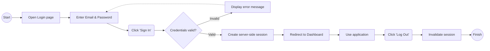
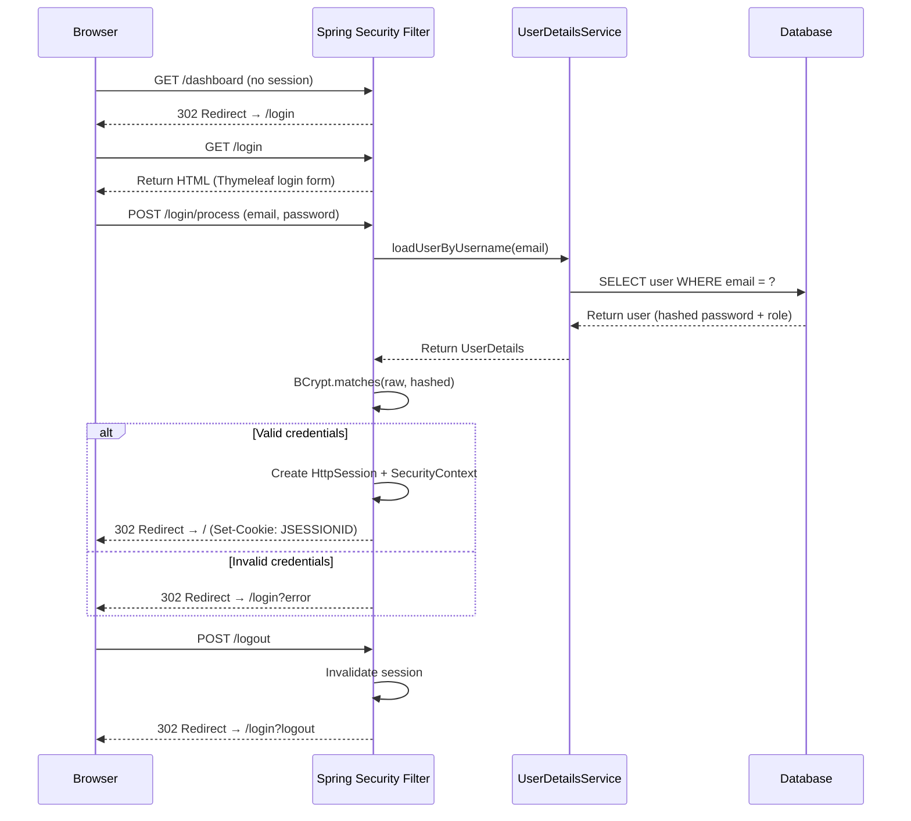

# Feature #2 *User Authentication*: User can log in and log out
---
## Changelog
| Version | Date       | Description     | Authors                             |
|---------|------------|-----------------|-------------------------------------|
| 1.0     | 2026-06-07 | Initial feature | [m000gg](https://github.com/m000gg) |
---

## 👔 Part 1: Product & Business

### Executive Summary
This feature allows users to authenticate into their respective applications — `admin`
or `client` — using an email and password. Upon successful login, the system creates
a server-side session identified by an HTTP-only cookie. Users can explicitly terminate
their session via logout. Both applications share the same authentication scheme but
run as fully independent Spring Boot services.

### Feature Objectives
- **Specific:** Provide a secure, form-based login and logout flow for both the admin
  and client applications, enforcing role-based access so that only authorized users
  can reach protected routes.
- **Measurable:** The feature is considered complete when 100% of protected routes
  redirect unauthenticated users to `/login`, and successful login redirects to the
  dashboard.
- **Attainable:** Built entirely with Spring Security's built-in form login — no
  custom auth infrastructure required.
- **Realistic:** Eliminates unauthorized access and provides a clear entry/exit point
  for every user session.
- **Time-bound:** 2 days for implementation and testing across both applications.

### Feature Scope
**In-scope:** Login form (`/login`), form submission processing (`/login/process`),
session creation, logout (`/logout`), redirect logic, and error display on invalid
credentials.

**Out-of-scope:** Password reset, remember-me, account lockout after failed attempts,
and email-based flows.

### User Flow

### Use Cases
- **Successful Login:** User enters valid email and password → system creates a session
  and redirects to `/`.
- **Invalid Credentials:** User enters wrong email or password → system re-renders the
  login page with a generic error message (no hint which field is wrong).
- **Logout:** Authenticated user clicks "Log Out" → session is invalidated and user
  is redirected to `/login?logout`.
- **Unauthorized Access:** Unauthenticated user tries to access any protected route →
  system redirects to `/login`.

### Functional Requirements
- The system must provide a login page at `/login` with email and password fields.
- The system must process credentials via `POST /login/process`.
- The system must validate credentials against the database using `UserDetailsService`.
- On success, the system must create a session and redirect the user to `/`.
- On failure, the system must redirect back to `/login?error` and display an error.
- The system must provide logout at `POST /logout`, invalidate the session, and
  redirect to `/login?logout`.
- All routes except `/login`, `/login/process`, and `/assets/**` must require
  authentication.

### Non-Functional Requirements
- **Security:** Session cookie must be HTTP-only. Passwords are never stored in
  plaintext — BCrypt hashing is enforced via `PasswordEncoder`.
- **Performance:** Login and logout must complete in under 1 second.
- **Usability:** Error messages must not reveal whether the email or password was
  incorrect (prevent user enumeration).

## 🛠 Part 2: Technical Realisation

### Architecture & Integrations
*Implemented tools:* Java / Spring Boot, Spring Security (form login, session
management, BCrypt), Thymeleaf (SSR), PostgreSQL.

Both `admin` and `client` are independent applications, each with its own
`SecurityFilterChain` and `UserDetailsService` querying the shared database.

*Sequence diagram:*

### Open Questions
*No questions.*