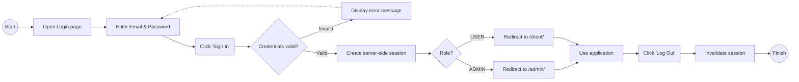
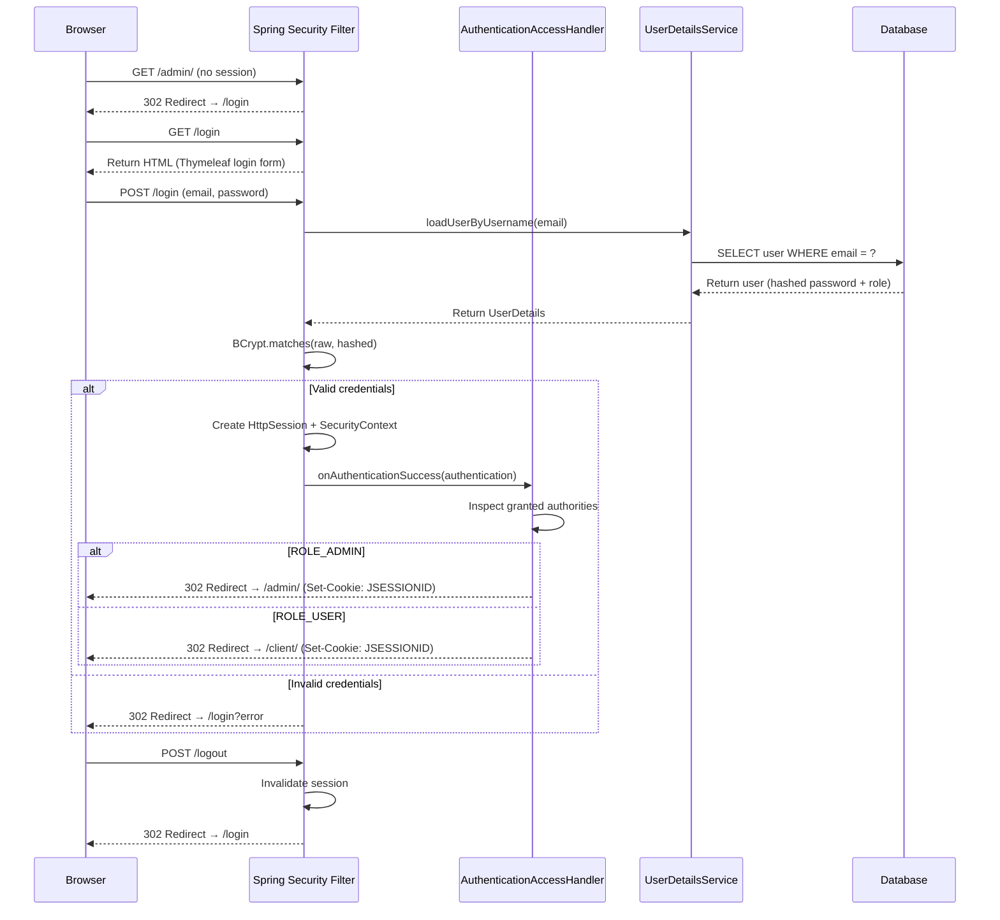

# Feature #2 *User Authentication*: User can log in and log out
---
## Changelog
| Version   | Date       | Description                                                                   | Authors                             |
|-----------|------------|-------------------------------------------------------------------------------|-------------------------------------|
| 1.0       | 2026-06-07 | Initial feature                                                               | [m000gg](https://github.com/m000gg) |
| 1.1       | 2026-07-29 | Unified login page with role-based redirect via `AuthenticationAccessHandler` | [m000gg](https://github.com/m000gg) |
---

- Issue #14 ➔ PR #20

## 👔 Part 1: Product & Business

### Executive Summary
This feature allows users to authenticate into the application — accessing either
the admin panel or the client portal, depending on their role — using an email and
password. Both areas share a single login page; after successful authentication the
system inspects the user's role and redirects them to the admin panel or the client
portal accordingly. The system creates a server-side session identified by an
HTTP-only cookie. Users can explicitly terminate their session via logout. The
admin and client areas share the same authentication scheme and run within a single
Spring Boot application.

### Feature Objectives
- **Specific:** Provide a secure, form-based login and logout flow for both the admin
  and client areas of the application, enforcing role-based access so that only
  authorized users can reach protected routes, and routing authenticated users to
  the correct area based on their role.
- **Measurable:** The feature is considered complete when 100% of protected routes
  redirect unauthenticated users to `/login`, and successful login redirects admins
  to `/admin/` and regular users to `/client/`.
- **Attainable:** Built entirely with Spring Security's built-in form login and a
  custom `AuthenticationSuccessHandler` — no custom auth infrastructure required.
- **Realistic:** Eliminates unauthorized access and provides a clear entry/exit point
  for every user session, regardless of role.
- **Time-bound:** 2 days for implementation and testing.

### Feature Scope
**In-scope:** Unified login form (`/login`), form submission processing, session
creation, role-based redirect after login, logout (`/logout`), and error display on
invalid credentials.

**Out-of-scope:** Password reset, remember-me, account lockout after failed attempts,
and email-based flows.

### User Flow

### Use Cases
- **Successful Login (Admin):** User enters valid credentials for an account with role
  `ADMIN` → system creates a session and redirects to `/admin/`.
- **Successful Login (Client):** User enters valid credentials for an account with role
  `USER` → system creates a session and redirects to `/client/`.
- **Invalid Credentials:** User enters wrong email or password → system re-renders the
  login page with a generic error message (no hint which field is wrong).
- **Logout:** Authenticated user clicks "Log Out" → session is invalidated and user
  is redirected to `/login`.
- **Unauthorized Access:** Unauthenticated user tries to access any protected route →
  system redirects to `/login`.

### Functional Requirements
- The system must provide a single, unified login page at `/login` with email and
  password fields, shared by both admin and client users.
- The system must validate credentials against the database using `UserDetailsService`.
- On success, the system must create a session and, via `AuthenticationAccessHandler`,
  inspect the authenticated user's role and redirect: `ROLE_ADMIN` → `/admin/`,
  `ROLE_USER` → `/client/`.
- On failure, the system must redirect back to `/login` with an error indication and
  display an error message.
- The system must provide logout at `/logout`, invalidate the session, and redirect
  to `/login`.
- Access to `/admin/**` must require `ROLE_ADMIN`; access to `/client/**` must
  require `ROLE_USER`, enforced independently of the redirect logic.
- All routes except `/login`, `/css/**`, `/swagger-ui/**`, `/v3/api-docs/**`, and
  `/forgot-password` must require authentication.

### Non-Functional Requirements
- **Security:** Session cookie must be HTTP-only. Passwords are never stored in
  plaintext — BCrypt hashing is enforced via `PasswordEncoder`. Role-based redirect
  is a UX convenience only — actual route protection is enforced by the security
  filter chain, not by the redirect handler.
- **Performance:** Login and logout must complete in under 1 second.
- **Usability:** Error messages must not reveal whether the email or password was
  incorrect (prevent user enumeration). A single login page removes the need for
  users to know which area's login URL to use.

## 🛠 Part 2: Technical Realisation

### Architecture & Integrations
*Implemented tools:* Java / Spring Boot, Spring Security (form login, session
management, BCrypt), Thymeleaf (SSR), PostgreSQL.

The admin panel (`web/admin`) and client portal (`web/client`) are part of the same
Spring Boot application, sharing a `UserDetailsService` querying the database and a
single `SecurityFilterChain` (`SecurityConfig`). Role-based access rules determine
which routes each authenticated user can reach. After successful authentication,
`AuthenticationAccessHandler` (implementing `AuthenticationSuccessHandler`) reads the
granted authorities from the `Authentication` object and redirects the user to
`/admin/` or `/client/` accordingly.

*Sequence diagram:*

### Open Questions
*No questions.*