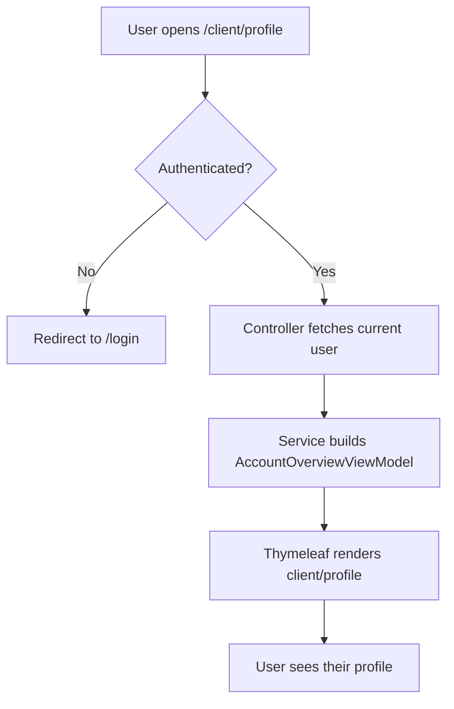
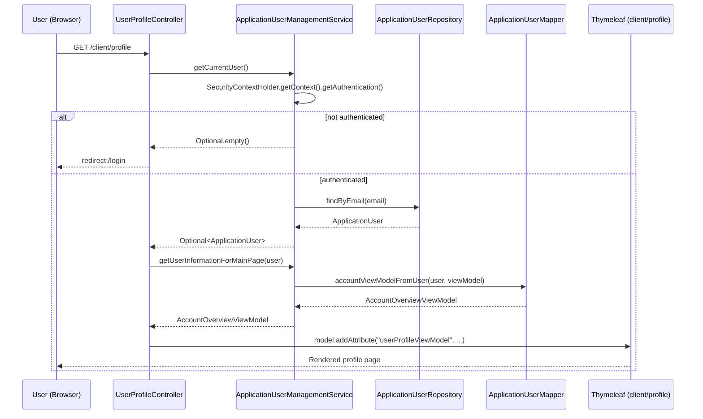

# Feature #: User Profile View

---
## Changelog
| Version   | Date       | Description                               | Authors                             |
|-----------|------------|-------------------------------------------|-------------------------------------|
| 1.0       | 2026-08-06 | Initial version of "Profile View" feature | [m000gg](https://github.com/m000gg) |
---

- Issue #17 ➔ PR #23

## 👔Part 1: Product & Business

### Executive Summary
Clients need a way to view their account data — personal info, address, contact details, and current balance — on a dedicated profile page.

### Feature objectives
- Give an authenticated user access to `/client/profile` with a full account summary using no more than 1 DB query per profile view.
- Ensure unauthenticated users are always redirected to `/login` when attempting to access the profile page.

### Feature scope
**In scope:**
- Display personal data (first name, last name, email, phone)
- Display address (country, region, city, street, house number, apartment, postal code)
- Display current balance
- Display account creation date

**Out of scope:**
- Editing the profile (separate feature)
- Changing password / email (separate feature)
- Transaction / payment history

### User flow

### Use cases
| # | Scenario | Expected result |
|---|----------|------------------|
| 1 | Authenticated user opens `/client/profile` | Page shows up-to-date account data |
| 2 | Unauthenticated user opens `/client/profile` | Redirect to `/login` |
| 3 | User is missing part of their address data | Page renders without errors, empty fields left blank |
| 4 | User's session expires while viewing | Redirect to `/login` on next request |

### Functional Requirements
- The profile page is only available at `/client/profile` and requires an active session
- Displayed data: full name, email, phone, balance, address (country, region, city, street, house number, apartment, postal code), account creation date
- The current user is resolved via `Authentication` (email from Spring Security context), not from request parameters
- Data is read-only on this screen — no modification is possible from this view

### Non-Functional Requirements
- The page response is generated with at most 1 query to `ApplicationUserRepository` (no N+1)
- The page is rendered server-side (Thymeleaf), with no separate REST API and no sensitive data exposed to JS
- Personal data (email, phone, address, balance) is never logged

## 🛠Part 2: Technical Realisation

### Architecture & Integrations
Implemented entirely within the `web/client` module (SSR, Thymeleaf) — no REST API between admin and client; the service reads data directly from the DB via `ApplicationUserManagementService`.

**Components involved:**
- `UserProfileController` (`web/client`) — handles `GET /client/profile`
- `ApplicationUserManagementService` (`identity`) — fetches the current user and maps it to a ViewModel
- `ApplicationUserMapper` — maps `ApplicationUser` ➔ `AccountOverviewViewModel`
- `ApplicationUserRepository` — DB access (`findByEmail`)
- Thymeleaf template `client/profile.html`

### Data models
No new data is created — existing `ApplicationUser` data is read and projected into a ViewModel for display.

`AccountOverviewViewModel` — presentation DTO, not a persistent entity:

| Field       | Type       | Source                    |
|-------------|------------|---------------------------|
| firstName   | String     | ApplicationUser           |
| lastName    | String     | ApplicationUser           |
| email       | String     | ApplicationUser           |
| balance     | BigDecimal | ApplicationUser           |
| country     | String     | ApplicationUser (address) |
| region      | String     | ApplicationUser (address) |
| city        | String     | ApplicationUser (address) |
| street      | String     | ApplicationUser (address) |
| houseNumber | String     | ApplicationUser (address) |
| apartment   | String     | ApplicationUser (address) |
| postalCode  | String     | ApplicationUser (address) |
| createdAt   | Date       | ApplicationUser           |
| phone       | String     | ApplicationUser           |

Mapping from `ApplicationUser` to `AccountOverviewViewModel` is done in `ApplicationUserMapper#accountViewModelFromUser`.

### API
No REST API is used — the page is rendered server-side via Thymeleaf as part of Spring MVC.

`GET /client/profile`

**Auth:** requires an active session (JSESSIONID), otherwise `redirect:/login`

**Response:** HTML page `client/profile` with model attribute `userProfileViewModel`

### Open questions
None.