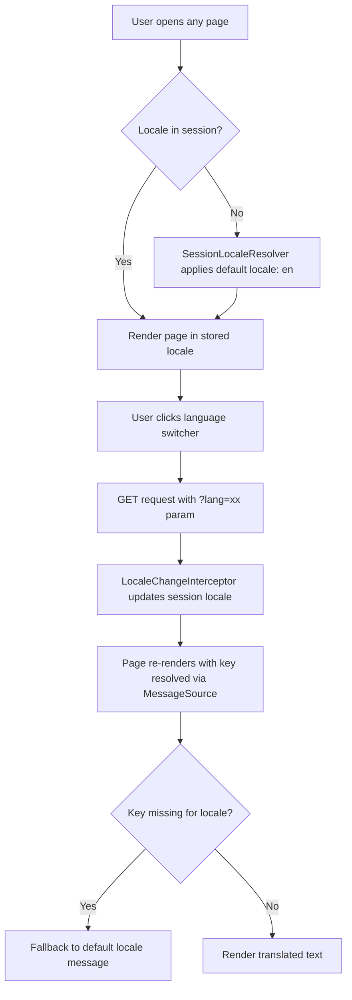
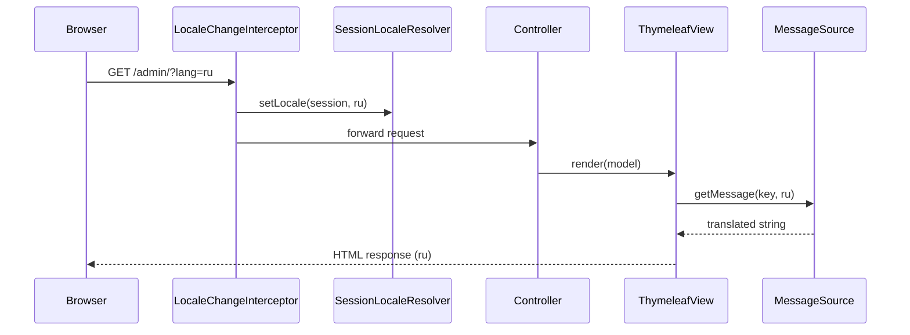

# Feature #5: Internationalization (i18n) Support

---
## Changelog
| Version | Date       | Description   | Authors                             |
|---------|------------|---------------|-------------------------------------|
| 1.0     | 2026-08-16 | Initial draft | [m000gg](https://github.com/m000gg) |
---

- Issue #24 ➔ PR #27

## 👔Part 1: Product & Business

### Executive Summary
The billing platform currently serves UI content only in English, but the target user base (subscribers and admin operators) is primarily Russian- and Ukrainian-speaking, with German and French markets also in scope. This feature adds full internationalization to both the admin and client-facing Thymeleaf applications, allowing users to switch between 5 languages (ru, uk, de, en, fr) and see all UI text — labels, buttons, notifications, validation errors, and billing domain terms — translated accordingly.

### Feature objectives
- Support 5 languages (ru, uk, de, en, fr) across all admin and client-facing pages by the end of the sprint
- Eliminate 100% of hardcoded UI strings from Thymeleaf templates and backend validation/notification messages
- Allow users to switch language in under 2 clicks from any page, with the selection persisting for the duration of their session
- Ship with zero missing-translation fallback errors (missing key always resolves to the default locale instead of throwing or rendering a raw key)

### Feature scope
**In scope:**
- Language switcher UI component (admin sidebar, client login page)
- Message property files per module (`i18n/admin`, `i18n/client`, `i18n/subscribers`, `i18n/identity`, `i18n/catalog`, `i18n/ledger`, `i18n/subscriptions`, `i18n/common`)
- Translation of static UI text, dynamic backend messages (validation errors, flash notifications), and billing domain terms (transaction types, statuses, categories)
- Locale switching via `?lang=` query parameter, resolved and stored via `SessionLocaleResolver`

**Out of scope:**
- Real-time translation API integrations (Google Translate, DeepL, etc.)
- User-contributed translation workflow / community translation platforms (Crowdin, Lokalise, etc.)
- Right-to-left (RTL) language support
- Persisting language preference beyond the session (e.g. cookie- or account-level persistence) — tracked as a follow-up decision

### User flow

### Use cases
- A Russian-speaking admin opens the dashboard, switches language to `ru` via the sidebar dropdown, and all sidebar links, page headers, and card labels render in Russian.
- A subscriber submits an invalid login form; the validation error message is displayed in their currently selected language.
- A user switches to French, navigates across several pages within the same session; the language selection persists without needing to re-select it.
- A translation key is missing for `de` on a newly added page; the page falls back to displaying the default locale (`en`) text instead of a raw key or blank string.
- An admin views a subscriber's profile with an address containing an apartment number; the "Apt." label renders correctly translated and reused consistently across the profile and users-list pages.

### Functional Requirements
- All static UI text in Thymeleaf templates must be resolved via `#{key}` message expressions \
- All dynamic backend-generated messages (validation errors, flash notifications) must be resolved via `messageSource.getMessage()` \
- Language must be switchable via a `?lang=` request parameter on any page \
- Selected language must persist across requests for the duration of the user's session \
- All 5 supported languages (ru, uk, de, en, fr) must have complete translations for shipped UI surfaces \
- Missing translation keys must fall back to the default locale rather than rendering an error or raw key \
- Message keys must be namespaced per module (`admin.*`, `client.*`, `subscribers.*`, etc.) matching the `spring.messages.basename` split

### Non-Functional Requirements
- Message resolution must not introduce noticeable page-render latency (property file lookups only, no runtime translation calls) \
- Property files must be UTF-8 encoded (`spring.messages.encoding=UTF-8`) to support Cyrillic text without escaping \
- Message key naming convention must be documented so contributors can add new keys consistently \
- No `th:onsubmit`/inline JS event attributes may hold raw translated strings directly (Thymeleaf 3.1+ restricts this) — dynamic confirm dialogs must use `data-*` attributes read by a script

## 🛠Part 2: Technical Realisation

### Architecture & Integrations
**Implemented tools:**
- Spring `MessageSource` with per-module `basename` list (`i18n/common`, `i18n/admin`, `i18n/client`, `i18n/identity`, `i18n/catalog`, `i18n/ledger`, `i18n/subscribers`, `i18n/subscriptions`)
- `SessionLocaleResolver` (default locale `Locale.US`) — bean-configured in `LanguageConfiguration`
- `LocaleChangeInterceptor` bound to `?lang=` parameter, registered via `WebMvcConfigurer#addInterceptors`
- Thymeleaf `#{key}` expressions in templates; `#messages.msg(key, args, locale)` for message resolution inside non-text contexts (string concatenation, `th:with` variables consumed by `data-*` attributes)

**Sequence diagram:**

### Data models
No persistent data model changes. Translations are stored as static `.properties` files on the classpath, one file per `(module, locale)` pair, e.g. `i18n/admin_ru.properties`, `i18n/subscribers_de.properties`. Key naming follows `<module>.<page>.<element>` (e.g. `subscribers.userProfile.deleteConfirm`), with shared keys (e.g. `subscribers.userProfile.apt`) reused across pages within the same module rather than duplicated.

### API
No new REST endpoints are introduced. Locale switching is a standard GET request parameter handled by the existing MVC layer: