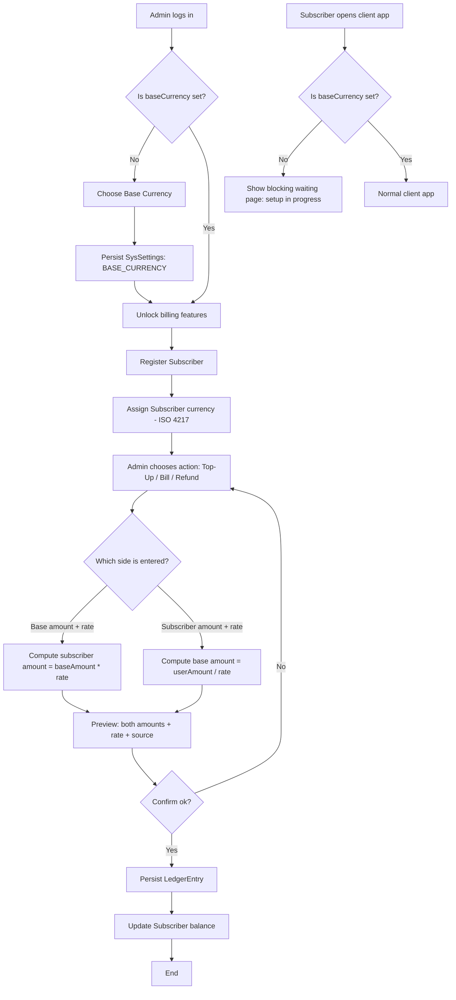
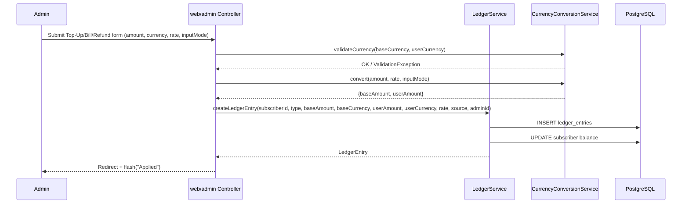
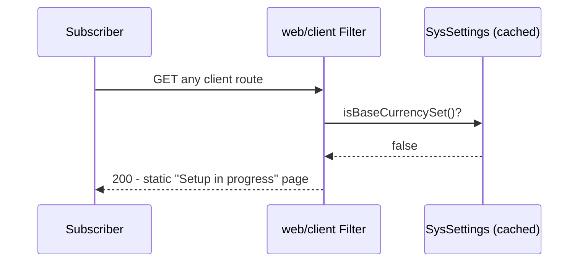

# Feature #7: Multi-Currency Billing Support

---
## Changelog
| Version | Date       | Description                                                                                | Authors                             |
|---------|------------|--------------------------------------------------------------------------------------------|-------------------------------------|
| 1.0     | 2026-09-07 | Initial draft: base currency setup, per-subscriber currency, manual FX-rate ledger entries | [m000gg](https://github.com/m000gg) |
---

- Issue #29 ➔ PR #29

## 👔Part 1: Product & Business

### Executive Summary
Unit Billing currently records every transaction in a single implicit currency. This feature introduces multi-currency support: an enterprise-wide **base currency** is fixed once during initial system setup, each **subscriber** is assigned their own operating currency at registration, and operators can record top-ups, bills and refunds by manually entering an **exchange rate** at the moment of the transaction — with no dependency on an external FX-rate provider. This enables a single Unit Billing instance to service subscribers across multiple countries/currencies (e.g. an operator based in Ukraine billing subscribers in Germany, UK and Ukraine) while keeping all internal reporting comparable in one base currency. Until `baseCurrency` is configured, the client application is fully locked behind a waiting page — no subscriber can use it.

### Feature objectives
- **S**pecific: allow every `LedgerEntry` (top-up, bill, refund) to be recorded in a subscriber's own currency while always persisting the equivalent amount in the enterprise base currency, using a manually entered exchange rate.
- **M**easurable: 100% of new ledger entries store both `amount` (subscriber currency) and `baseAmount` (base currency) with a traceable `exchangeRate` and `exchangeSource`; 0 dependency on third-party FX APIs; 100% of client requests are blocked with a waiting page while `baseCurrency` is unset.
- **A**ttainable: reuses the existing `ledger`, `subscribers`, and system-settings infrastructure already in the single-module Spring Boot codebase; no new external integrations required.
- **R**ealistic: scope is deliberately limited to the ledger layer (see Out of Scope) to fit within the current architecture and team size.
- **T**ime-bound: target completion — *TBD, to be set once scope below is confirmed* (see Open Questions).

### Feature scope
**In scope**
- One-time configuration of the enterprise `baseCurrency` during first-setup wizard.
- `currency` attribute on the `Subscriber` entity, set at registration, editable by an admin afterwards.
- Manual exchange-rate entry on Top-Up, Bill and Refund actions, entered from **either** direction (base amount → derive subscriber amount, or subscriber amount → derive base amount).
- Server-side validation of currency codes (ISO 4217) and of the exchange rate.
- Correct `BigDecimal` storage, rounding and currency-aware formatting in Thymeleaf views.
- Localized labels/messages related to currency and exchange rate fields.
- **Client-side lock:** while `baseCurrency` is not yet set, the `web/client` app must not serve normal pages to subscribers — every route returns a blocking "setup in progress, please wait" page instead.

**Out of scope**
- Automated real-time exchange-rate integrations (ECB, Open Exchange Rates, etc.).
- Automatic currency detection/conversion based on geolocation or IP.
- Multi-currency wallets (a subscriber holding balances in more than one currency simultaneously).
- Cryptocurrency support.
- Changing `baseCurrency` after initial setup (confirmed: **not supported** — would require re-stating every historical `LedgerEntry`).
- Currency conversion in the `catalog`/subscription-pricing module — plans remain priced in `baseCurrency` only; conversion happens exclusively at the `LedgerEntry` (ledger) level in v1.

### User flow


### Use cases
- **UC1** — First-time base currency setup: admin sets `baseCurrency`, value is persisted and becomes immutable.
- **UC2** — Attempt to change `baseCurrency` after it is already set: rejected (feature not exposed / hard blocked server-side).
- **UC3** — Register a new subscriber and assign their currency (ISO 4217 code, validated via `java.util.Currency`).
- **UC4** — Top-up: admin enters amount in **base currency** + rate → subscriber-currency amount is computed and both are stored.
- **UC5** — Top-up: admin enters amount in **subscriber currency** + rate → base-currency amount is computed and both are stored.
- **UC6** — Bill a subscriber in their own currency with a manually entered rate (same bidirectional entry as UC4/UC5).
- **UC7** — Refund referencing an `originalEntryId`, with a rate entered independently of the original entry's rate (FX gain/loss between top-up and refund is accepted business behavior — *to confirm, see Open Questions*).
- **UC8** — Validation failure: currency code is not a valid ISO 4217 code → transaction rejected with a localized error.
- **UC9** — Validation failure: exchange rate is zero, negative, or not provided → transaction rejected.
- **UC10** — Subscriber balance and ledger history are displayed with correct currency symbol/formatting per their assigned currency and the active UI locale.
- **UC11** — A subscriber (or anyone) opens the `web/client` app while `baseCurrency` has not yet been configured → gets a blocking waiting page instead of any normal page (login, dashboard, etc.).

### Functional Requirements
- The system must allow setting `baseCurrency` exactly once, during first-setup, and must block any later change.
- Every `Subscriber` must have a non-null `currency` (ISO 4217) that defaults at registration and can be edited by an admin.
- Top-Up, Bill and Refund forms must accept exchange-rate entry from **either** direction (base→subscriber or subscriber→base) and compute the other side automatically before persisting.
- The system must record, per `LedgerEntry`: `userCurrency`, `amount` (in `userCurrency`), `baseCurrency`, `baseAmount`, `exchangeRate`, `exchangeSource`, and which side was manually entered vs. derived.
- The system must validate that both `baseCurrency` and `userCurrency` are valid ISO 4217 codes using `java.util.Currency`.
- The system must reject a transaction if `exchangeRate` is `<= 0` or absent.
- Refunds must reference the original `LedgerEntry` via `originalEntryId` and independently capture their own `amount`/`baseAmount`/`exchangeRate` (per UC7).
- Currency amounts must be displayed with the correct number of fraction digits and symbol for their currency (via `Currency.getDefaultFractionDigits()` / locale-aware `NumberFormat`).
- All new labels, validation messages and notifications must be localized in every language currently supported by the app (see Open Questions for exact locale list).
- **While `baseCurrency` is not set, every route in `web/client` must be intercepted (e.g. a filter/interceptor checking `SysSettings.BASE_CURRENCY`) and redirected to a static "please wait, setup in progress" page — no login, dashboard, or balance data may be reachable.** The `web/admin` app remains fully accessible so the setup wizard itself can be completed.

### Non-Functional Requirements
- All monetary values must use `BigDecimal` end-to-end (no `double`/`float`) with a fixed, documented rounding mode (proposed: `RoundingMode.HALF_UP`, scale = currency's default fraction digits) — to confirm in Open Questions.
- `exchangeRate` must be stored with sufficient precision to avoid rounding drift on round-trip conversion (proposed scale: 6 decimal places) — to confirm.
- Every currency-conversion calculation must be auditable: the persisted `LedgerEntry` alone must be enough to reproduce `baseAmount` from `amount`+`exchangeRate` (or vice versa) without needing external state.
- Changing a `Subscriber`'s `currency` must not retroactively alter any existing `LedgerEntry`.
- The feature must not introduce any new external network dependency (no FX-rate API calls).
- Performance: currency validation/conversion must add no perceptible latency to the existing Top-Up/Bill/Refund flows (single in-process computation, no I/O).
- The client-side lock check must be cheap (in-memory cached flag, invalidated once on setup completion) — it must not add a DB round-trip to every client request indefinitely.

## 🛠Part 2: Technical Realisation

### Architecture & Integrations
**Implemented tools**
- `java.util.Currency` — validation of ISO 4217 codes for both `baseCurrency` and `userCurrency`, and retrieval of default fraction digits for formatting/rounding.
- `java.math.BigDecimal` — all monetary arithmetic, with an explicit `MathContext`/`RoundingMode`.
- Flyway — migration adding `currency` to `subscribers`, and the currency/exchange-rate columns to `ledger_entries` (per the existing `ledger` module).
- Existing `identity` / `subscribers` / `ledger` / `web/admin` / `web/client` packages — no new modules introduced; logic lives in a new `CurrencyConversionService` inside `ledger`, plus a `BaseCurrencyGuardFilter`/interceptor in `web/client`.

**Sequence diagram**




### Data models

## `sys_settings` (existing table, reused)

| Key             | Value example   | Notes                                                                          |
|-----------------|-----------------|--------------------------------------------------------------------------------|
| `BASE_CURRENCY` | `USD`           | Written once during first setup; read-only afterwards at the application layer |

## `Subscriber` (extended)

| Field        | Type                         | Notes                                                                                                  |
|--------------|------------------------------|--------------------------------------------------------------------------------------------------------|
| `currency`   | `String` (ISO 4217, 3 chars) | Not null; set at registration, editable by admin; validated via `java.util.Currency.getInstance(code)` |

## `LedgerEntry`

| Field              | Type                                              | Notes                                                                                                        |
|--------------------|---------------------------------------------------|--------------------------------------------------------------------------------------------------------------|
| `id`               | `UUID`                                            | PK                                                                                                           |
| `subscriberId`     | `UUID`                                            | FK → subscribers                                                                                             |
| `originalEntryId`  | `UUID`                                            | Nullable; only for `REFUND`                                                                                  |
| `createdAt`        | `Instant`                                         |                                                                                                              |
| `type`             | `EntryType` (`TOPUP`/`BILL`/`REFUND`)             |                                                                                                              |
| `description`      | `String`                                          |                                                                                                              |
| `source`           | `EntrySource`                                     | e.g. `SALARY`, `ORDER`, `INCORRECT_ORDER`                                                                    |
| `performedByAdmin` | `UUID`                                            |                                                                                                              |
| `userCurrency`     | `String` (ISO 4217)                               | Snapshot of subscriber's currency at time of entry                                                           |
| `amount`           | `BigDecimal`                                      | In `userCurrency`                                                                                            |
| `baseCurrency`     | `String` (ISO 4217)                               | Snapshot of enterprise base currency                                                                         |
| `baseAmount`       | `BigDecimal`                                      | In `baseCurrency`                                                                                            |
| `exchangeRate`     | `BigDecimal`                                      | Units of `userCurrency` per 1 unit of `baseCurrency` — see formula below                                     |
| `exchangeSource`   | `String`                                          | e.g. bank name, `"manual"`                                                                                   |
| `inputMode`        | `AmountInputMode` (`BASE_ENTERED`/`USER_ENTERED`) | *Proposed addition* — records which side the operator actually typed, since the other side is always derived |

### Exchange rate formula

| Direction entered by operator   | Formula applied                          |
|---------------------------------|------------------------------------------|
| Base amount + rate              | `userAmount = baseAmount × exchangeRate` |
| Subscriber amount + rate        | `baseAmount = userAmount ÷ exchangeRate` |

> The two hand-sketched examples used inconsistent directions (multiply for UAH, divide for EUR). This model fixes a **single canonical direction** — `exchangeRate` always means "units of `userCurrency` per 1 unit of `baseCurrency`" — so the formula never depends on which currency is involved, only on which side the operator entered.

### API
> The app is server-rendered (Thymeleaf, session-based auth, no REST layer between admin/client apps). Endpoints below are the Spring MVC controller contracts backing the forms; shown as JSON-equivalent payloads for documentation purposes.

**New endpoint:** `POST /admin/billing-setup` *(first setup only, idempotent-guarded)*
```json
{ "baseCurrency": "USD" }
```

**Client-side behavior (no dedicated endpoint):** every `web/client` route is intercepted by `BaseCurrencyGuardFilter`. While `SysSettings.BASE_CURRENCY` is unset, the filter short-circuits the request chain and renders a static "setup in progress" Thymeleaf view instead of forwarding to the requested controller.

### Open questions
- *Q1:* Confirm rounding strategy — `RoundingMode.HALF_UP` and scale = `Currency.getDefaultFractionDigits()` for display amounts. OK, or does finance/accounting require `HALF_EVEN`?
- *Q2:* Confirm storage scale for `exchangeRate` (proposed: 6 decimal places) — enough precision to avoid round-trip drift?
- *Q3:* For refunds (UC7): is it acceptable that a refund's exchange rate differs from the original entry's rate (creating an FX gain/loss), or must refunds always reuse the original entry's `exchangeRate`?
- *Q4:* Full list of locales that must receive the new currency-related labels/messages (assumption: RU, EN, DE — please confirm/extend).
- *Q5:* Is `inputMode` (which side was manually entered) worth persisting for audit, or is it acceptable to only store the two computed amounts + rate without recording direction?
- *Q6:* Should there be an admin-managed allow-list of supported currencies (subset of ISO 4217), or is any valid ISO 4217 code acceptable for `baseCurrency`/`Subscriber.currency`?
- *Q7:* Should the client waiting-page also cover authenticated sessions (a subscriber already logged in gets logged out / blocked mid-session), or only block fresh/unauthenticated access until setup is done?