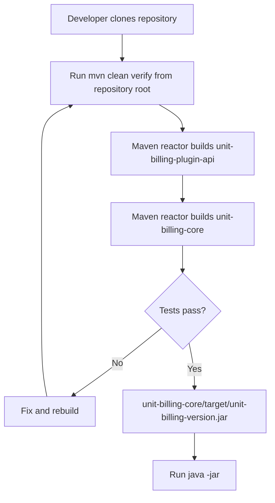
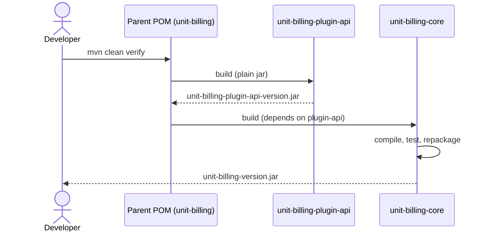

# Feature #8: Multi-Module Structure and Plugin Foundation

---
## Changelog
| Version   | Date       | Description                                                                   | Authors                             |
|-----------|------------|-------------------------------------------------------------------------------|-------------------------------------|
| 1.0       | 2026-10-10 | Initial version: Maven multi-module split and empty plugin API module         | [m000gg](https://github.com/m000gg) |
---

- Issue #43 ➔ PR #95

## 👔Part 1: Product & Business


### Executive Summary
The platform is going to be extended with plugins (user notifications, payment
methods, dashboards) that live outside this repository and are delivered as
jars. Before any plugin functionality can be built, the project needs a
boundary between the application and the contract that plugins compile
against. This feature introduces that boundary by splitting the single Maven
project into two modules. No plugin functionality is delivered yet, and the
behaviour of the billing application does not change.

### Feature objectives
- **Specific:** split the project into `unit-billing-core` (the application) and `unit-billing-plugin-api` (an empty module reserved for the plugin contract).
- **Measurable:** `mvn clean verify` from the repository root succeeds for all modules, all existing tests stay green, and `unit-billing-plugin-api` has no dependencies.
- **Attainable:** the change is limited to moving files and POM configuration, with no changes to business logic.
- **Realistic:** the application starts from the new jar location and behaves as before.
- **Time-bound:** done within the scope of this PR, before any plugin interface work starts.

### Feature scope
**Included:**
- Parent `pom.xml` with two modules
- Application sources and `pom.xml` moved into `unit-billing-core` (history preserved with `git mv`)
- Empty `unit-billing-plugin-api` module (plain jar, no Spring/JPA, no `spring-boot-maven-plugin`)
- Dependency of `unit-billing-core` on `unit-billing-plugin-api`
- Executable jar name kept as `unit-billing-<version>.jar`
- ADR0009 and a draft plugin developer guide
- Updated project structure and a Plugins chapter in `README.md`

**Left out:**
- Plugin interfaces and DTOs (extension points, `PaymentGateway`, etc.)
- Plugin loader, classloader strategy, manifest, permissions, audit
- Plugin directory on the server, database schema, System Settings UI for plugins
- Publishing `unit-billing-plugin-api` to a remote Maven repository
- Updating `Jenkinsfile` and deploy scripts for the new layout
- Any change to billing core logic

### User flow
*Developer workflow after the change.*



### Use cases
1. **Full build from the root:** `mvn clean verify` builds both modules in the right order and runs all existing tests.
2. **Application start:** the jar from `unit-billing-core/target/` starts with the same profiles and database as before, and Flyway applies no new migrations.
3. **API module isolation:** `mvn -pl unit-billing-plugin-api dependency:tree` shows no dependencies.
4. **Build of the core only:** `mvn -pl unit-billing-core -am package` builds `unit-billing-plugin-api` first and then `unit-billing-core`.
5. **Build from the wrong directory:** running `mvn` inside `unit-billing-core/` fails to resolve `unit-billing-plugin-api` (expected; documented in ADR0009).

### Functional Requirements
- The repository root contains a parent `pom.xml` with the modules `unit-billing-plugin-api` and `unit-billing-core`.  \
- All existing application sources, resources and tests live under `unit-billing-core/`.  \
- `unit-billing-plugin-api` is a plain jar without dependencies and without `spring-boot-maven-plugin`.  \
- `unit-billing-core` depends on `unit-billing-plugin-api`.  \
- The executable jar is named `unit-billing-<version>.jar`.  \
- No billing logic is modified.

### Non-Functional Requirements
- File history is preserved (moves done with `git mv`, shown as renames).  \
- The plugin boundary is enforced by the build: Spring and JPA are not on the API module's classpath.  \
- No change in runtime behaviour, configuration or database schema.  \
- Java version and Spring Boot version are defined once, in the parent POM.


## 🛠Part 2: Technical Realisation

### Architecture & Integrations
*Implemented tools:* Maven multi-module build (reactor), parent POM inheriting from `spring-boot-starter-parent`.



Module layout:

```text
unit-billing/                  ← parent POM
├─ unit-billing-plugin-api/    ← empty contract module
└─ unit-billing-core/          ← the application
```

See [ADR0009](../adr/0009-multi-module-and-plugin-api.md) for the reasoning behind the split.

### Data models
No new data models. Database schema and Flyway migrations are unchanged.

### API
No new endpoints. The HTTP API (`docs/openapi.yaml`) is unchanged.

### Open questions
- Q1: When should the `Jenkinsfile` path to the jar be updated (it still points to the root `target/`, so deploy from this branch will fail)?  \
