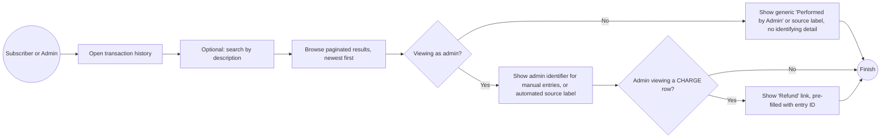
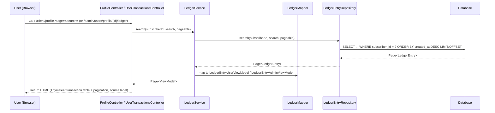

# Feature #5: Transaction History — Paginated & Searchable Ledger View

---
## Changelog
| Version     | Date       | Description                                                                  | Authors                             |
|-------------|------------|------------------------------------------------------------------------------|-------------------------------------|
| 1.0         | 2026-08-12 | Initial feature                                                              | [m000gg](https://github.com/m000gg) |
| 1.1         | 2026-08-13 | Added transaction source/performer visibility (`source`, `performedByAdmin`) | [m000gg](https://github.com/m000gg) |
---

- Issue #16 ➔ PR #27

## 👔Part 1: Product & Business

### Executive Summary
This feature gives subscribers and administrators visibility into a subscriber's ledger history (created by the existing balance-adjustment feature). Subscribers can view their own transaction history on their profile and see the 5 most recent entries on their dashboard. Administrators can view any subscriber's full transaction history, with search and pagination, and issue refunds directly from the list. Both views now also show who or what triggered each transaction — an administrator (with identifying detail shown to admins only) or an automated payment source.

### Feature objectives
- Specific: Provide subscribers and administrators a paginated, searchable view of existing `LedgerEntry` records, including the origin of each transaction.
- Measurable: Transaction lists load correctly for any subscriber, sorted newest-first, with working pagination, search, and accurate source/performer attribution.
- Attainable: Built on the existing `LedgerEntry` data created by the balance-adjustment feature and the pagination pattern already used for `ApplicationUser` search.
- Realistic: Required so subscribers can review their own charges/payments, and admins can audit an account and trace which administrator (or automated system) performed a given action before taking further action.
- Time-bound: 1 day for development and testing.

### Feature scope
In-scope: paginated/searchable transaction list on the client profile, last-5 preview on the client dashboard, paginated/searchable transaction list on the admin subscriber-detail view, a "Refund" link on eligible `CHARGE` rows in the admin view (routes to the existing refund action), transaction source display (client: generic label; admin: specific admin identifier for manual actions).

Out-of-scope: creating or editing ledger entries (covered by the existing adjustments feature), invoices/receipts as a separate document concept, exporting history (CSV/PDF), actual automated payment gateway integrations (PayPal/Apple Pay) — only the `source` field and display are covered here, in preparation for those integrations.

### User flow

### Use cases
- **View own history (subscriber):** Subscriber opens their profile ➔ sees a paginated list of their own transactions (description, type, date, amount, generic source label).
- **Dashboard preview:** Subscriber opens the dashboard ➔ sees their 5 most recent transactions.
- **View subscriber history (admin):** Admin opens a subscriber's transaction list ➔ sees the same fields plus internal reference data (entry ID, linked original entry for refunds) and the specific admin who performed each manual action.
- **Search:** User or admin filters the list by description text.
- **Refund shortcut (admin):** Admin sees a `CHARGE` row ➔ clicks "Refund" ➔ taken to the existing refund form with the original entry pre-filled.
- **Empty state:** No transactions match the filter/subscriber ➔ list shows an empty-state message instead of an empty table.
- **Manual entry attribution (admin):** Admin views a manually created entry ➔ sees which administrator performed it.
- **Automated entry attribution (future-ready):** Entry created by an automated source (e.g. PayPal, Apple Pay) ➔ both client and admin views show the source label instead of an admin identifier.

### Functional Requirements
- The system must expose a paginated transaction list to subscribers, scoped to their own account only.
- The system must expose a paginated transaction list to administrators for any subscriber, resolved by subscriber ID from the URL path.
- Transaction lists must be sorted newest-first and support free-text search on the description field, per ADR0006.
- The client-facing view must not expose internal fields (`id`, `subscriberId`, `originalEntryId`) or the identity of the administrator who performed a manual action.
- The client-facing view must show a generic source indicator ("Performed by Admin" for manual entries, or the automated source name for others).
- The admin-facing view must expose all fields, including `source` and the specific `performedByAdmin` identifier for manual entries, with UUIDs truncated by default and expandable on click.
- The admin transaction list must show a "Refund" link on `CHARGE` entries, linking to the existing refund action with the entry ID pre-filled.
- The client dashboard must show the 5 most recent transactions without pagination controls.

### Non-Functional Requirements
- **Performance:** Transaction list pages must load in under 1 second for typical subscriber history sizes, per the offset-pagination approach in ADR0006.
- **Security:** Subscribers can only query their own ledger entries (subscriber ID resolved from session, never from client input); administrators access entries by explicit subscriber ID from the URL path. Administrator identity for manual actions is never exposed to the client-facing view.
- **Usability:** Transaction type is visually distinguished with color-coded badges; long UUIDs are truncated by default and expandable on click.

## 🛠Part 2: Technical Realisation

### Architecture & Integrations
*Implemented tools:* Java / Spring Boot, Spring Data JPA (`Pageable`/`Page<T>`, per ADR0006), Thymeleaf (Server-Side Rendering), PostgreSQL.

### Sequence diagram

### Data models
**`LedgerEntry`** — gained two fields (from the adjustments feature): `source: EntrySource` (`ADMIN`, `PAYPAL`, `APPLE_PAY`) and `performedByAdmin: UUID` (nullable — set only when `source = ADMIN`, references `admins.id`).

**`LedgerEntryUserViewModel`** (client-facing, read-only) — `amount`, `type`, `createdAt`, `description`, `source`. No `id`, `subscriberId`, `originalEntryId`, or `performedByAdmin`.

**`LedgerEntryAdminViewModel`** (admin-facing, read-only) — all `LedgerEntryUserViewModel` fields plus `id`, `subscriberId`, `originalEntryId`, `performedByAdmin`, `refundable`.

*(`LedgerEntry` itself is not owned by this feature — it's created and mutated by the existing balance-adjustment feature.)*

### API
No REST API — SSR via Thymeleaf, consistent with the rest of the platform. Relevant routes:
- `GET /client/profile?page=&size=&search=` — subscriber's own paginated ledger, with generic source label.
- `GET /client/` — dashboard, last 5 entries.
- `GET /admin/users/profile/{id}/ledger?page=&size=&search=` — admin view of a subscriber's paginated ledger, with Refund link and specific admin attribution.

### Open questions
*No questions.*